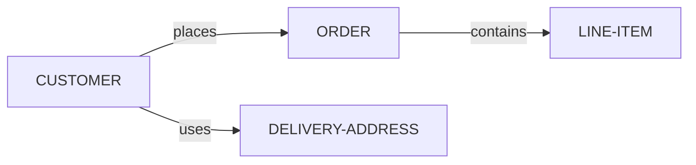

# KBTG Backend API

> Backend project using Go, Fiber framework, and SQLite database with CRUD operations.

## 📋 Table of Contents

- [Prerequisites](#prerequisites)
- [Features](#features)
- [Installation](#installation)
- [Running the Application](#running-the-application)
- [Database](#database)
- [API Endpoints](#api-endpoints)
- [Example Usage](#example-usage)
- [Build](#build)
- [Project Structure](#project-structure)
- [Technologies](#technologies)
- [Documentation](#documentation)
- [Contributing](#contributing)
- [Author](#author)

## 🔧 Prerequisites

Before you begin, ensure you have the following installed:

- **Go** 1.21 or higher - [Download](https://go.dev/dl/)
- **Git** (optional) - [Download](https://git-scm.com/downloads)

## ✨ Features

- RESTful API with Fiber framework
- SQLite database with GORM ORM
- CRUD operations for Customers and Orders
- Auto-migration database schema
- CORS enabled
- Request logging middleware
- Comprehensive API documentation

## 📦 Installation

1. **Clone the repository** (if you haven't already):
   ```bash
   git clone https://github.com/tawanrutp/temp_kbtg_backend.git
   cd temp_kbtg_backend
   ```

2. **Install dependencies**:
   ```bash
   go mod tidy
   ```

## 🚀 Running the Application

Start the development server:

```bash
go run main.go
```

The server will start on **http://localhost:3000**

You should see:
```
Database connected successfully
Database migration completed
Server starting on http://localhost:3000
```

## 🗄️ Database

The application uses **SQLite** database with the following structure:

| Table | Description |
|-------|-------------|
| `customers` | Customer information |
| `delivery_addresses` | Customer delivery addresses |
| `orders` | Customer orders |
| `line_items` | Order line items |

> **Note**: Database will be auto-created and migrated on first run.

For detailed database schema and ERD diagram, see [database.md](database.md)

## 🌐 API Endpoints

### Base URL
```
http://localhost:3000
```

### General Endpoints

| Method | Endpoint | Description |
|--------|----------|-------------|
| `GET` | `/` | Welcome message and API info |
| `GET` | `/hello` | Hello World endpoint |

### Customer Endpoints

| Method | Endpoint | Description |
|--------|----------|-------------|
| `GET` | `/api/v1/customers` | Get all customers |
| `GET` | `/api/v1/customers/:id` | Get customer by ID |
| `POST` | `/api/v1/customers` | Create new customer |
| `PUT` | `/api/v1/customers/:id` | Update customer |
| `DELETE` | `/api/v1/customers/:id` | Delete customer |

### Order Endpoints

| Method | Endpoint | Description |
|--------|----------|-------------|
| `GET` | `/api/v1/orders` | Get all orders |
| `GET` | `/api/v1/orders/:id` | Get order by ID |
| `POST` | `/api/v1/orders` | Create new order |
| `PUT` | `/api/v1/orders/:id` | Update order |
| `DELETE` | `/api/v1/orders/:id` | Delete order |

> 📚 For detailed API documentation with examples, see [API_USAGE.md](API_USAGE.md)

## 💡 Example Usage

### Quick Start Examples

**1. Create a customer**
```bash
curl -X POST http://localhost:3000/api/v1/customers \
  -H "Content-Type: application/json" \
  -d "{\"name\":\"John Doe\",\"email\":\"john@example.com\",\"phone\":\"0812345678\"}"
```

**Response:**
```json
{
  "success": true,
  "data": {
    "id": 1,
    "name": "John Doe",
    "email": "john@example.com",
    "phone": "0812345678",
    "created_at": "2025-10-17T10:00:00Z",
    "updated_at": "2025-10-17T10:00:00Z"
  }
}
```

**2. Get all customers**
```bash
curl http://localhost:3000/api/v1/customers
```

**3. Create an order**
```bash
curl -X POST http://localhost:3000/api/v1/orders \
  -H "Content-Type: application/json" \
  -d "{\"customer_id\":1,\"status\":\"pending\",\"total_price\":1500.00}"
```

## 🏗️ Build

To build the executable:

```bash
go build -o app.exe main.go
```

Then run:

```bash
.\app.exe
```

## 📁 Project Structure

```
temp_kbtg_backend/
├── main.go                      # Main application entry point
├── go.mod                       # Go module dependencies
├── go.sum                       # Go module checksums
├── kbtg.db                      # SQLite database (auto-created)
│
├── models/
│   └── customer.go              # Database models (Customer, Order, etc.)
│
├── database/
│   └── database.go              # Database connection and initialization
│
├── handlers/
│   ├── customer_handler.go      # Customer CRUD handlers
│   └── order_handler.go         # Order CRUD handlers
│
├── routes/
│   └── routes.go                # API routes setup
│
└── docs/
    ├── API_USAGE.md             # Detailed API documentation
    ├── database.md              # Database schema documentation
    └── README.md                # Project documentation
```

## 🛠️ Technologies

| Technology | Version | Purpose |
|------------|---------|---------|
| [Go](https://golang.org/) | 1.21+ | Programming language |
| [Fiber](https://docs.gofiber.io/) | v2.52.0 | Web framework |
| [GORM](https://gorm.io/) | v1.25.5 | ORM library |
| [SQLite](https://www.sqlite.org/) | 3.x | Database |

## 📚 Documentation

- [API Usage Guide](API_USAGE.md) - Complete API documentation with examples
- [Database Schema](database.md) - Database structure and ERD diagrams

## 🔗 Relationships



**Entity Relationships:**
- **CUSTOMER** → places → **ORDER** (One-to-Many)
- **CUSTOMER** → uses → **DELIVERY-ADDRESS** (One-to-Many)
- **ORDER** → contains → **LINE-ITEM** (One-to-Many)

## 🤝 Contributing

Contributions are welcome! Please follow these steps:

1. Fork the repository
2. Create your feature branch (`git checkout -b feature/AmazingFeature`)
3. Commit your changes (`git commit -m 'Add some AmazingFeature'`)
4. Push to the branch (`git push origin feature/AmazingFeature`)
5. Open a Pull Request

## 📝 License

This project is licensed under the MIT License.

## 👤 Author

**Tawanrut P.**
- GitHub: [@tawanrutp](https://github.com/tawanrutp)
- Repository: [temp_kbtg_backend](https://github.com/tawanrutp/temp_kbtg_backend)

## 🙏 Acknowledgments

- Inspired by [KBTG AI Workshop](https://github.com/mikelopster/kbtg-ai-workshop-oct)
- Built with [Fiber](https://gofiber.io/) framework
- Database management with [GORM](https://gorm.io/)

---

<div align="center">
  <p>Made with ❤️ for KBTG Workshop</p>
  <p>© 2025 Tawanrut P. All rights reserved.</p>
</div>
