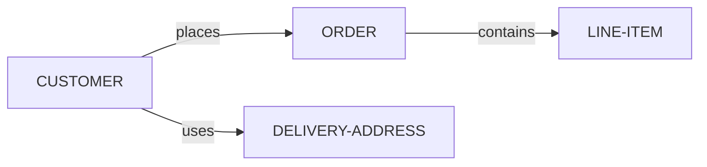

# KBTG Backend API

Backend project using Go, Fiber framework, and SQLite database with CRUD operations.

## Prerequisites

- Go 1.21 or higher
- Git (optional)

## Features

✅ RESTful API with Fiber framework  
✅ SQLite database with GORM  
✅ CRUD operations for Customers and Orders  
✅ **Point Transfer System** - Transfer points between users with idempotency  
✅ **Point Ledger** - Track all point transactions with detailed history  
✅ **OpenAPI 3.0 Specification** - Complete API documentation in swagger.yml  
✅ Auto-migration database schema  
✅ Transaction support for atomic operations  
✅ CORS enabled  
✅ Request logging middleware  

## 📦 Installation

1. **Clone the repository** (if you haven't already):
   ```bash
   git clone https://github.com/tawanrutp/temp_kbtg_backend.git
   cd temp_kbtg_backend
   ```

2. **Install dependencies**:
   ```bash
   go mod tidy
   ```

## 🚀 Running the Application

Start the development server:

```bash
go run main.go
```

The server will start on **http://localhost:3000**

You should see:
```
Database connected successfully
Database migration completed
Server starting on http://localhost:3000
```

## Database

The application uses SQLite database (`kbtg.db`) with the following tables:
- **customers** - Customer information
- **delivery_addresses** - Customer delivery addresses
- **orders** - Customer orders
- **line_items** - Order line items
- **users** - Users with point balances
- **transfers** - Point transfers between users
- **point_ledger** - Transaction history for all point changes

Database will be auto-created and migrated on first run.

## API Endpoints

### General
- `GET /` - Welcome message and API info
- `GET /hello` - Hello World endpoint

### Customers (CRUD)
- `GET /api/v1/customers` - Get all customers
- `GET /api/v1/customers/:id` - Get customer by ID
- `POST /api/v1/customers` - Create new customer
- `PUT /api/v1/customers/:id` - Update customer
- `DELETE /api/v1/customers/:id` - Delete customer

### Orders (CRUD)
- `GET /api/v1/orders` - Get all orders
- `GET /api/v1/orders/:id` - Get order by ID
- `POST /api/v1/orders` - Create new order
- `PUT /api/v1/orders/:id` - Update order
- `DELETE /api/v1/orders/:id` - Delete order

### Users (CRUD)
- `GET /api/v1/users` - Get all users
- `GET /api/v1/users/:id` - Get user by ID
- `POST /api/v1/users` - Create new user
- `PUT /api/v1/users/:id` - Update user
- `DELETE /api/v1/users/:id` - Delete user
- `GET /api/v1/users/:id/balance` - Get user balance

### Transfers
- `POST /api/v1/transfers` - Create point transfer (with idempotency)
- `GET /api/v1/transfers` - Get all transfers (with filters)
- `GET /api/v1/transfers/:id` - Get transfer by idempotency key
- `DELETE /api/v1/transfers/:id` - Cancel transfer

### Point Ledger
- `GET /api/v1/users/:user_id/ledger` - Get user's transaction history

## API Documentation

📘 **OpenAPI Specification**: [`swagger.yml`](swagger.yml) - Complete API specification in OpenAPI 3.0.3 format

View the interactive documentation:
- Use [Swagger Editor](https://editor.swagger.io/) - Import `swagger.yml`
- Use Swagger UI locally - See [SWAGGER_GUIDE.md](SWAGGER_GUIDE.md)
- Validate compliance - Run `validate_swagger_compliance.bat`

See also:
- [TRANSFER_API.md](TRANSFER_API.md) - Transfer API detailed guide
- [API_USAGE.md](API_USAGE.md) - Customer/Order API guide
- [SWAGGER_GUIDE.md](SWAGGER_GUIDE.md) - How to use the Swagger specification

## 💡 Example Usage

### Quick Start Examples

**1. Create a customer**
```bash
curl -X POST http://localhost:3000/api/v1/customers \
  -H "Content-Type: application/json" \
  -d "{\"name\":\"John Doe\",\"email\":\"john@example.com\",\"phone\":\"0812345678\"}"
```

**2. Get all customers**
```bash
curl http://localhost:3000/api/v1/customers
```

**3. Create an order**
```bash
curl -X POST http://localhost:3000/api/v1/orders \
  -H "Content-Type: application/json" \
  -d "{\"customer_id\":1,\"status\":\"pending\",\"total_price\":1500.00}"
```

## 🏗️ Build

To build the executable:

```bash
go build -o app.exe main.go
```

Then run:

```bash
.\app.exe
```

## 📁 Project Structure

```
temp_kbtg_backend/
├── main.go                      # Main application entry point
├── go.mod                       # Go module dependencies
├── go.sum                       # Go module checksums
├── kbtg.db                      # SQLite database (auto-created)
│
├── models/
│   └── customer.go              # Database models (Customer, Order, etc.)
│
├── database/
│   └── database.go              # Database connection and initialization
│
├── handlers/
│   ├── customer_handler.go      # Customer CRUD handlers
│   └── order_handler.go         # Order CRUD handlers
│
├── routes/
│   └── routes.go                # API routes setup
│
└── docs/
    ├── API_USAGE.md             # Detailed API documentation
    ├── database.md              # Database schema documentation
    └── README.md                # Project documentation
```

## 🛠️ Technologies

| Technology | Version | Purpose |
|------------|---------|---------|
| [Go](https://golang.org/) | 1.21+ | Programming language |
| [Fiber](https://docs.gofiber.io/) | v2.52.0 | Web framework |
| [GORM](https://gorm.io/) | v1.25.5 | ORM library |
| [SQLite](https://www.sqlite.org/) | 3.x | Database |

## 📚 Documentation

- [API Usage Guide](API_USAGE.md) - Complete API documentation with examples
- [Database Schema](database.md) - Database structure and ERD diagrams

## 🔗 Relationships



- **CUSTOMER** → places → **ORDER** (One-to-Many)
- **CUSTOMER** → uses → **DELIVERY-ADDRESS** (One-to-Many)
- **ORDER** → contains → **LINE-ITEM** (One-to-Many)

## 🤝 Contributing

1. Fork the repository
2. Create your feature branch (`git checkout -b feature/AmazingFeature`)
3. Commit your changes (`git commit -m 'Add some AmazingFeature'`)
4. Push to the branch (`git push origin feature/AmazingFeature`)
5. Open a Pull Request

## 📝 License

This project is licensed under the MIT License.

## 👤 Author

**Tawanrut P.**
- GitHub: [@tawanrutp](https://github.com/tawanrutp)

## 🙏 Acknowledgments

- Inspired by [KBTG AI Workshop](https://github.com/mikelopster/kbtg-ai-workshop-oct)
- Built with [Fiber](https://gofiber.io/) framework

## Technologies

- [Go](https://golang.org/) - Programming language
- [Fiber](https://docs.gofiber.io/) - Web framework
- [GORM](https://gorm.io/) - ORM library
- [SQLite](https://www.sqlite.org/) - Database

## Database Schema

Based on the ERD diagram provided:

- **CUSTOMER** → places → **ORDER**
- **CUSTOMER** → uses → **DELIVERY-ADDRESS**
- **ORDER** → contains → **LINE-ITEM**

All relationships are properly defined in the models with foreign keys.
