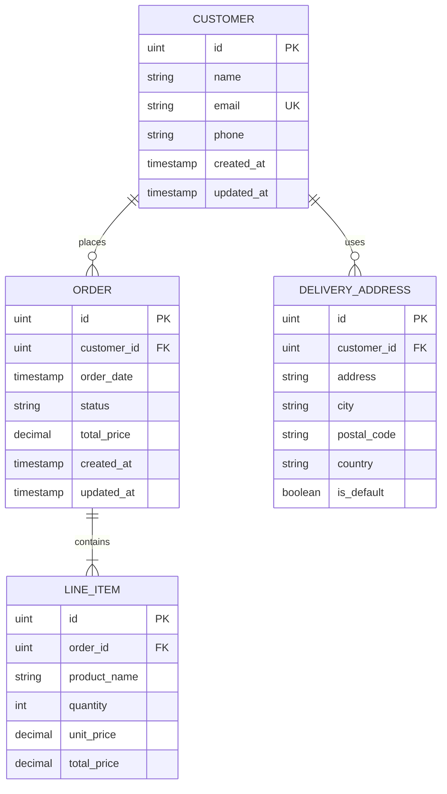
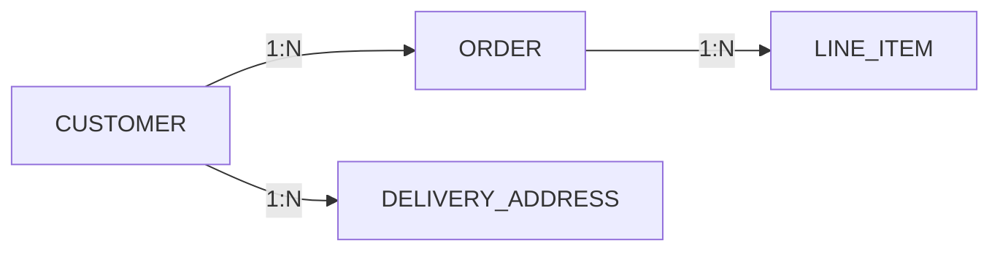

# Database Documentation

## Overview

This document describes the database schema for the KBTG Backend API. The application uses **SQLite** as the database engine with **GORM** as the ORM library.

## Database File

- **File Name**: `kbtg.db`
- **Location**: Project root directory
- **Type**: SQLite 3
- **ORM**: GORM v1.25.5

## Entity Relationship Diagram



## Tables

### 1. customers

Stores customer information.

| Column      | Type      | Constraints                | Description                    |
|-------------|-----------|----------------------------|--------------------------------|
| id          | INTEGER   | PRIMARY KEY, AUTOINCREMENT | Unique customer identifier     |
| name        | VARCHAR(100) | NOT NULL                | Customer full name             |
| email       | VARCHAR(100) | NOT NULL, UNIQUE        | Customer email address         |
| phone       | VARCHAR(20)  |                         | Customer phone number          |
| created_at  | TIMESTAMP | NOT NULL                   | Record creation timestamp      |
| updated_at  | TIMESTAMP | NOT NULL                   | Record last update timestamp   |

**Indexes:**
- PRIMARY KEY on `id`
- UNIQUE INDEX on `email`

**Relationships:**
- One-to-Many with `orders` (A customer can place multiple orders)
- One-to-Many with `delivery_addresses` (A customer can have multiple addresses)

---

### 2. delivery_addresses

Stores customer delivery addresses.

| Column      | Type      | Constraints                | Description                    |
|-------------|-----------|----------------------------|--------------------------------|
| id          | INTEGER   | PRIMARY KEY, AUTOINCREMENT | Unique address identifier      |
| customer_id | INTEGER   | NOT NULL, FOREIGN KEY      | Reference to customer          |
| address     | VARCHAR(255) | NOT NULL                | Street address                 |
| city        | VARCHAR(100) |                         | City name                      |
| postal_code | VARCHAR(20)  |                         | Postal/ZIP code                |
| country     | VARCHAR(100) |                         | Country name                   |
| is_default  | BOOLEAN   | DEFAULT false              | Is this the default address?   |

**Indexes:**
- PRIMARY KEY on `id`
- INDEX on `customer_id`

**Relationships:**
- Many-to-One with `customers` (Many addresses can belong to one customer)

**Foreign Keys:**
- `customer_id` REFERENCES `customers(id)`

---

### 3. orders

Stores customer orders.

| Column      | Type      | Constraints                | Description                    |
|-------------|-----------|----------------------------|--------------------------------|
| id          | INTEGER   | PRIMARY KEY, AUTOINCREMENT | Unique order identifier        |
| customer_id | INTEGER   | NOT NULL, FOREIGN KEY      | Reference to customer          |
| order_date  | TIMESTAMP | NOT NULL                   | Date and time of order         |
| status      | VARCHAR(50) | DEFAULT 'pending'        | Order status                   |
| total_price | DECIMAL(10,2) | DEFAULT 0.00           | Total order price              |
| created_at  | TIMESTAMP | NOT NULL                   | Record creation timestamp      |
| updated_at  | TIMESTAMP | NOT NULL                   | Record last update timestamp   |

**Indexes:**
- PRIMARY KEY on `id`
- INDEX on `customer_id`
- INDEX on `status`

**Relationships:**
- Many-to-One with `customers` (Many orders can belong to one customer)
- One-to-Many with `line_items` (An order can have multiple line items)

**Foreign Keys:**
- `customer_id` REFERENCES `customers(id)`

**Valid Status Values:**
- `pending` - Order is pending
- `processing` - Order is being processed
- `shipped` - Order has been shipped
- `delivered` - Order has been delivered
- `cancelled` - Order has been cancelled

---

### 4. line_items

Stores individual items within an order.

| Column       | Type      | Constraints                | Description                    |
|--------------|-----------|----------------------------|--------------------------------|
| id           | INTEGER   | PRIMARY KEY, AUTOINCREMENT | Unique line item identifier    |
| order_id     | INTEGER   | NOT NULL, FOREIGN KEY      | Reference to order             |
| product_name | VARCHAR(100) | NOT NULL                | Name of the product            |
| quantity     | INTEGER   | NOT NULL                   | Quantity ordered               |
| unit_price   | DECIMAL(10,2) | NOT NULL               | Price per unit                 |
| total_price  | DECIMAL(10,2) |                        | Total price (quantity * unit_price) |

**Indexes:**
- PRIMARY KEY on `id`
- INDEX on `order_id`

**Relationships:**
- Many-to-One with `orders` (Many line items belong to one order)

**Foreign Keys:**
- `order_id` REFERENCES `orders(id)`

---

## Relationships Summary



### Cardinality

- **CUSTOMER to ORDER**: One-to-Many (1:N)
  - A customer can place zero or many orders
  - An order belongs to exactly one customer

- **CUSTOMER to DELIVERY_ADDRESS**: One-to-Many (1:N)
  - A customer can have zero or many delivery addresses
  - A delivery address belongs to exactly one customer

- **ORDER to LINE_ITEM**: One-to-Many (1:N)
  - An order contains one or many line items
  - A line item belongs to exactly one order

---

## Database Initialization

The database is automatically initialized when the application starts:

1. **Connection**: Establishes connection to SQLite database file `kbtg.db`
2. **Auto-Migration**: Creates or updates tables based on model definitions
3. **Logging**: Enables SQL query logging for debugging

```go
// From database/database.go
func InitDatabase() {
    // Connect to SQLite
    DB, err = gorm.Open(sqlite.Open("kbtg.db"), &gorm.Config{
        Logger: logger.Default.LogMode(logger.Info),
    })
    
    // Auto migrate all models
    DB.AutoMigrate(
        &models.Customer{},
        &models.DeliveryAddress{},
        &models.Order{},
        &models.LineItem{},
    )
}
```

---

## Data Types Mapping

| Go Type    | SQLite Type      | Description                |
|------------|------------------|----------------------------|
| uint       | INTEGER          | Unsigned integer (ID)      |
| string     | TEXT/VARCHAR     | Variable length text       |
| bool       | INTEGER          | Boolean (0 or 1)           |
| float64    | REAL             | Decimal numbers            |
| time.Time  | DATETIME/TEXT    | Timestamp                  |

---

## Constraints and Validations

### NOT NULL Constraints
- `customers.name`
- `customers.email`
- `delivery_addresses.customer_id`
- `delivery_addresses.address`
- `orders.customer_id`
- `orders.order_date`
- `line_items.order_id`
- `line_items.product_name`
- `line_items.quantity`
- `line_items.unit_price`

### UNIQUE Constraints
- `customers.email` - Ensures no duplicate email addresses

### DEFAULT Values
- `orders.status` = `'pending'`
- `orders.total_price` = `0.00`
- `delivery_addresses.is_default` = `false`

### Foreign Key Constraints
- Enforced by GORM ORM
- Cascading deletes can be configured in the model definitions

---

## Sample Data

### Example Customer Record
```json
{
  "id": 1,
  "name": "John Doe",
  "email": "john.doe@example.com",
  "phone": "0812345678",
  "created_at": "2025-10-17T10:00:00Z",
  "updated_at": "2025-10-17T10:00:00Z"
}
```

### Example Order Record
```json
{
  "id": 1,
  "customer_id": 1,
  "order_date": "2025-10-17T10:30:00Z",
  "status": "pending",
  "total_price": 1500.00,
  "created_at": "2025-10-17T10:30:00Z",
  "updated_at": "2025-10-17T10:30:00Z"
}
```

### Example Line Item Record
```json
{
  "id": 1,
  "order_id": 1,
  "product_name": "Laptop",
  "quantity": 1,
  "unit_price": 1500.00,
  "total_price": 1500.00
}
```

### Example Delivery Address Record
```json
{
  "id": 1,
  "customer_id": 1,
  "address": "123 Main Street",
  "city": "Bangkok",
  "postal_code": "10110",
  "country": "Thailand",
  "is_default": true
}
```

---

## Migration Notes

- **Auto-Migration**: GORM automatically creates and updates table schemas
- **No Down Migrations**: Schema changes are forward-only
- **Data Preservation**: Existing data is preserved during migrations
- **New Columns**: Added with default values or NULL

---

## Performance Considerations

### Indexes
Recommended indexes are automatically created by GORM:
- Primary keys
- Foreign keys
- Unique constraints

### Query Optimization
- Use proper WHERE clauses with indexed columns
- Avoid SELECT * when possible
- Use pagination for large result sets

### Connection Pooling
SQLite is file-based and handles concurrency differently:
- Single writer, multiple readers
- Suitable for low to medium traffic applications
- For high-traffic, consider PostgreSQL or MySQL

---

## Backup and Maintenance

### Backup
```bash
# Simple file copy
cp kbtg.db kbtg.db.backup

# Or use SQLite backup command
sqlite3 kbtg.db ".backup 'kbtg.db.backup'"
```

### Restore
```bash
cp kbtg.db.backup kbtg.db
```

### Vacuum (Optimize)
```bash
sqlite3 kbtg.db "VACUUM;"
```

---

## Security Considerations

1. **SQL Injection**: GORM uses prepared statements, protecting against SQL injection
2. **Data Validation**: Validate data at the application level before database insertion
3. **Access Control**: Implement proper authentication and authorization
4. **Sensitive Data**: Consider encrypting sensitive fields like email or phone
5. **Backup Security**: Ensure database backups are stored securely

---

## Future Enhancements

Potential schema improvements:
- [ ] Add `product` table instead of storing product names in line items
- [ ] Add `payment` table to track payment information
- [ ] Add `shipping` table to track shipment details
- [ ] Implement soft deletes with `deleted_at` timestamp
- [ ] Add audit trails with `created_by` and `updated_by` fields
- [ ] Add indexes on frequently queried columns
- [ ] Implement full-text search on product names
